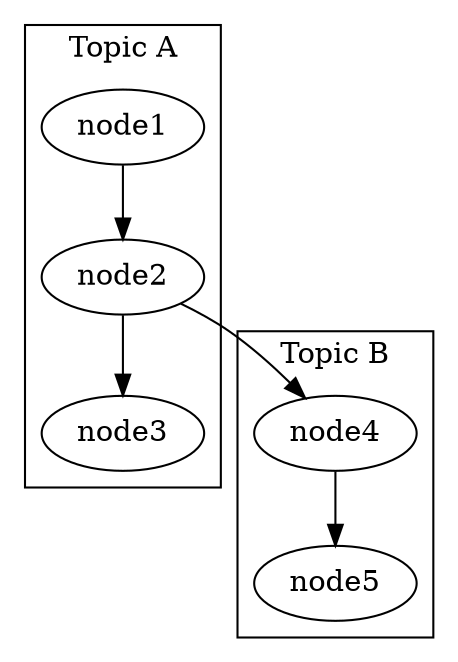

# Graph Analytics & Algorithms

> **Layer**: 1 | **Dependencies**: `core/types.md` | **Dependents**: `modules/graph-generation`, `modules/content-analysis`, `bridges/state-transition-engine`
> **Tags**: `#core` `#analytics` `#algorithms` `#graph-theory` `#symbolic`

## Network Metrics

### Modularity
Measures how well a graph decomposes into distinct clusters.
- **Range**: 0 (uniform) to 1 (perfectly clustered)
- **Optimal for creativity**: 0.3–0.6 (multiple distinct but connected clusters)
- **Too low** (<0.2): Ideas are undifferentiated, lacks structure
- **Too high** (>0.7): Ideas are siloed, lacks cross-pollination
- **Cognitive mapping**: Low modularity ≈ Focused state; High modularity ≈ Diversified state

### Betweenness Centrality (BC)
Measures how much a node bridges different parts of the network.
- **High BC nodes**: Conceptual gateways — bridge concepts connecting clusters
- **Hub detection**: Nodes with both high degree AND high BC dominate discourse
- **Cognitive mapping**: High-BC concepts are leverage points for state transitions

### Degree Distribution
- **Degree**: Number of edges connected to a node
- **Weighted degree**: Sum of edge weights for a node
- **Power-law distribution**: Healthy graphs have few high-degree hubs and many low-degree leaves
- **Top nodes entropy**: Measures concentration of influence (low entropy = over-focused)

### Diversity Statistics
```
diversity_score: overall balance metric
too_focused_on_top_nodes: boolean flag for hub dominance
too_focused_on_top_clusters: boolean flag for cluster dominance
ratio_of_top_nodes_influence_by_betweenness: hub gateway dominance
top_nodes_entropy: information distribution uniformity
ratio_of_top_cluster_influence_by_betweenness: cluster gateway balance
total_clusters: absolute cluster count
fair_influence_by_cluster: expected per-cluster influence if balanced
```

## Structural Analysis Patterns

### Gap Detection
Gaps are connections that SHOULD exist between clusters but DON'T.
```
Gap = { source_cluster, target_cluster, weight, bridging_concepts }
```
- **Weight**: Higher = more significant gap (more potential if bridged)
- **Bridging concepts**: Existing nodes that could connect the clusters
- **Creative insight**: Gaps represent the highest creative potential — innovations live here

### Cluster Analysis
Each cluster represents a coherent topic group.
```
Cluster = { community_id, nodes[], top_statement, ai_name }
```
- **Intra-cluster density**: How tightly connected nodes are within a cluster
- **Inter-cluster edges**: Cross-cluster connections (conceptual gateways)
- **Cluster balance**: Ratio of largest to smallest cluster (ideally <3:1)

### DOT Graph Representation
InfraNodus exports graph structure in DOT format, partitioned by cluster.


### Topological Sorting
For DAG traversal of dependency structures:
```
1. Identify all source nodes (no incoming edges)
2. Process each source, removing its outgoing edges
3. Repeat until all nodes processed
4. If unprocessed nodes remain → cycle detected
```

## Graph-to-Cognitive-State Mapping

| Graph Property | Cognitive State | Indicator |
|---------------|----------------|-----------|
| Single dominant cluster, low modularity | BIASED | One idea dominates |
| High density, clear narrative arc | FOCUSED | Everything connects coherently |
| Multiple clusters, visible gaps | DIVERSIFIED | Multiple perspectives, gaps = potential |
| Fragmented, weak connections | DISPERSED | Ideas scattered, maximum creative chaos |

## Transformation Functions

### transformToStructuredOutput
```
GraphResponse → KnowledgeGraphOutput
Extracts: modularity, clusters, nodes, edges, gaps, summaries, bigrams
Flags: includeGraph (raw structure), addNodesAndEdges, includeStatements
```

### generateInsights
```
GraphResponse + insightType → InsightsOutput
Types: summary, topics, gaps, questions, keyInsights
Aggregates: modularity analysis, topic dominance, network structure meta-insights
```

### extractLatentConcepts
```
GraphResponse → { ideas, latentConceptsToDevelop, latentConceptsRelations }
Sources: aiAdvice + conceptualGateways + topRelations
```

## Port Connections
- **Depends on**: `← core/types.md`
- **Consumed by**: `→ modules/graph-generation.md` `→ modules/content-analysis.md` `→ bridges/state-transition-engine.md`
- **Referenced by**: `→ resources/graph-metrics-reference.md`
